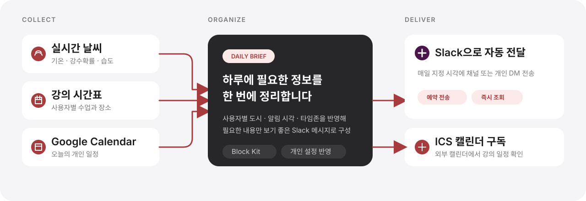
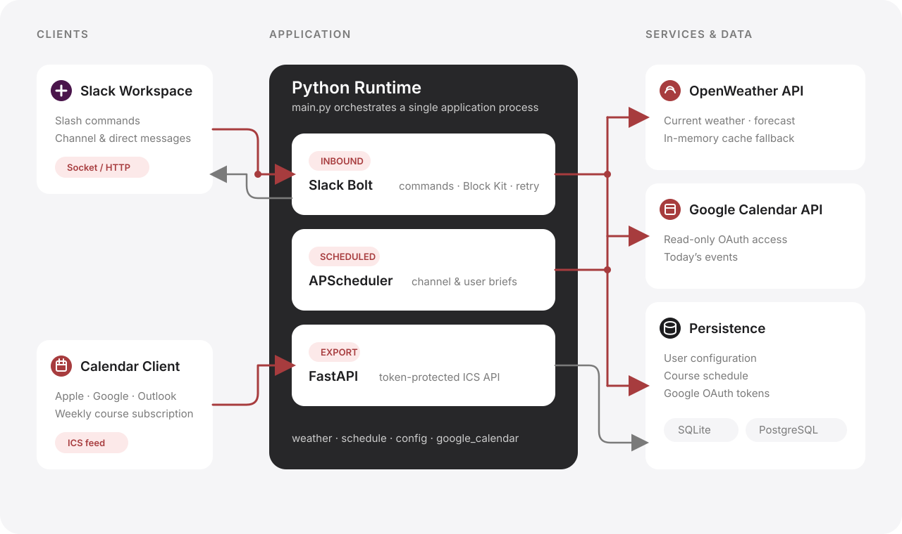
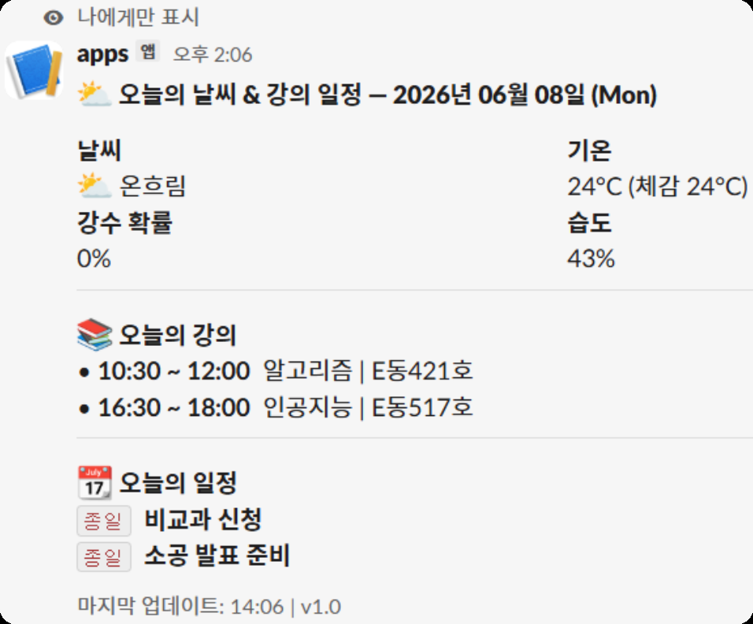

<h1 align="center">Slack Weather & Schedule Bot</h1>

  <b>매일 아침 날씨·강의 시간표·Google Calendar 일정을 Slack으로 자동 전달하는 봇</b> 
  슬래시 커맨드로 개인 일정·알림을 관리하고, 강의 시간표는 ICS 캘린더로 내보냅니다

  
  
  
  
  
  

  <a href="https://github.com/SE-SlackBot/main">Repository</a>

---

## 프로젝트 소개

  

## 핵심 기능

  

## 시스템 아키텍처

  

이 구조는 소규모 팀에서도 배포와 운영을 단순하게 유지하면서, Slack 명령 처리·예약 브리프·ICS 제공을 역할별로 분리하기 위해 선택했습니다.

또한 SQLite와 PostgreSQL을 함께 지원해 로컬 개발과 운영 환경을 같은 코드베이스로 대응하고, 외부 API 연동을 모듈화해 변경과 장애 대응이 쉽도록 구성했습니다.

## 배포 · 운영

Oracle Cloud Always Free VM에서 systemd로 상시 실행하고, nginx가 Slack 이벤트와 ICS API 요청을 각 포트로 전달합니다.

`main` 브랜치에 푸시하면 GitHub Actions가 Python 3.11 · 3.12 · 3.13에서 테스트를 실행하고, 통과한 커밋만 서버에 자동 배포합니다.

## 서비스 화면

  

## 팀 구성

<table>
  <tr><td align="center"></td><td><b>정상겸</b> Leader · Backend</td><td>프로젝트 설계 · 시간표 기능 · 사용자 설정 · 테스트 · 문서</td></tr>
  <tr><td align="center"></td><td><b>김준서</b> Backend · Infra</td><td>스케줄러 · Google Calendar 연동 · DB · 배포</td></tr>
  <tr><td align="center"></td><td><b>안현빈</b> Backend</td><td>Slack App 연동 · 슬래시 커맨드 · Block Kit 메시지</td></tr>
</table>
